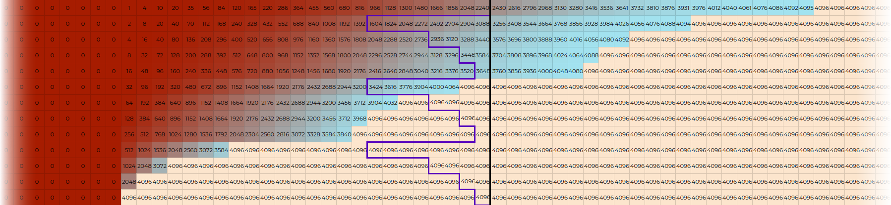

# Tensorflow implementation of WaveNet

This is an implementation of WaveNet in TensorFlow, mostly as practice, and to get
any feedback from the community, though I hope it will also be useful to others.

## Conditional independence across time boundary

WaveNet's stack of dilated convolutions means all nodes to the right of a time
boundary are conditionally independent from all nodes to the left given a
subset of those nodes, outlined in purple.  In particular, this means we can
compute the output of an arbitrarily long sequence in stages, each time storing
the values of only those purple nodes to continue the calculation.

The diagram below also illustrates how input nodes influence the output.  The
raw input is shown on the bottom row with dilated convolutions [1, 2, 4, 8] * 3
shown above, the top row being the final output.  The input values are zeros
extending infinitely to the left, and 4096 extending to the right, with a
boundary near the left end of the diagram.  All filter weights are set to
\[0.5, 0.5\].  In this setup, any given convolution node reflects the fraction
of zero and 4096-valued input nodes.  Notice that the top row nodes are zero up
until the point where the input transition starts.  Also, the left-most
4096-valued output node (top, towards the right) is the first position where
the receptive field does not cross the boundary in the input.  All output nodes
in between reflect a mix of influence from zero-valued and 4096-valued input.

Consider the convolutions extending indefinitely in either direction as shown.
At any given boundary (such as the black vertical line, the values of the set
of all nodes to the right only depend on the values of the nodes outlined in
purple.  All other nodes to the left merely propagate their influence via those
in purple. 




I use the same caching approach as @tomlepaine fast-wavenet for avoiding redundant
convolution calculations.  The cached values are stored in tf.Variable's so that the
values persist across sess.run() calls.

The chain of dilated convolutions are always stride=1 and VALID, so each output
tensor is shorter than the previous by the size of the dilation.  While it is
typical to think of the 'receptive field' of a single output node, in the WaveNet 
architecture, the receptive fields of any two adjacent output nodes are two
windows of input nodes offset by one position.  It is useful, then, to think of
"the receptive field of a window of output nodes" as a window of input.  The
relationship is:

```
output_sz = input_sz - burn_sz 
burn_sz = n_blocks * sum([2**l for l in range(n_block_layers)]).  
```

Note also that in computing windows of output at a time avoids redundant
calculations.  The redundant calculations only arise when one must break up the
input into certain sized lengths, either to compute a batch of gradients or to
fit within a certain memory.

lb-wavenet (lb = 'lookback') has two modes during training: 'initial mode' and
'continuation mode'.  In initial mode, it consumes some window of input and
produces a window of output shorter by burn_sz.  In continuation mode, it
consumes input and uses cached values of previous time steps for each
convolution (and input) so that it can consume input starting just after where
it left off.

In the animation below, hollow circles represent nodes that haven't been read
or calculated.  Solid represents read or calculated.  Red nodes are those
values stored in a variable to be read at the next execution of the computation
graph.  
   

## Computation graph configuration tensors

Both batch size and input length are unspecified in the graph.  Mode ('initial'
or 'continuation') is specified using a single 'is_first' int32 placeholder.
The tf.Variables used to store intermediate convolution values are fixed in
shape.  But, when run in 'initial' mode, the is_first value is used to
determine whether to prepend a zero-length slice or the full length slice of
these stored values. 


## SGD batch using consecutive samples from multiple .wav files

From the point of view of WaveNet, a single .wav file of length N represents N
- burn_sz individual training samples. Each sample is a window of burn_sz + 1
  input values, with the next value serving as the target.  I'll call two
adjacent windows 'consecutive samples'.  For a given SGD batch size, one might
ask whether the optimal batch would consist of scattered windows from the
files, or if it is okay to have a number of consecutive windows from each of a
smaller number of .wav files.  From a computational efficiency point of view,
insisting on completely scattered windows would be extremely inefficient,
requiring full computation of convolutions starting from the entire burn_sz
window.

In this work, my approach is to require consecutive samples of input in each
SGD batch, but to allow the user to choose the number of consecutive samples
and the number of concurrent .wav files.  The tradeoff can be adjusted by the
user.

The very first SGD batch includes the first samples from each .wav file.  For
example with VCTK files, a short period of background noise before the speaker
starts the sentence.  This first batch will be run in 'initial' mode.
Subsequent SGD batches will be run on the next window of input
(non-overlapping) using 'continuation' mode.  Because of the structure of the
network, the computed output values in continuation mode will be identical to
those that would be produced in initial mode with a longer window.

## Problem from different-length .wav files

The above initial / continuation scheme works assuming every .wav file is
exactly the same length.  Since the lengths are all different, I chose the
approach illustrated below.  


### Tradeoff between wasting calculation and excessive start-stop

There is a practical problem arising from the fact that 

 

